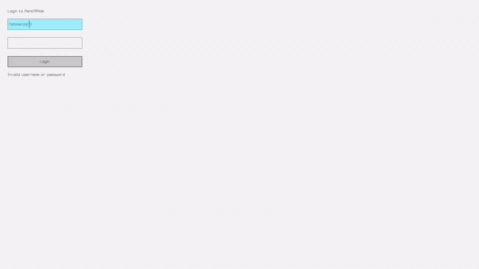

RentARide

Overview

RentARide is a simple car rental application built using C++ and raylib. It provides a graphical interface where users can log in, view available vehicles, set a budget and rental duration, and rent vehicles based on their preferences. Users can also view a list of rented vehicles.

Preview

Features:

->Login Screen: Users must log in before accessing the application.

->Budget Slider: Allows users to set their rental budget.

->Duration Slider: Users can specify the number of days they want to rent a vehicle.

->Vehicle Listing: Displays available vehicles with daily rates and images.

->Rental Functionality: Users can rent a vehicle if it fits within their budget.

->Rented Vehicles List: Displays all vehicles currently rented.

Technologies Used:

->C++: Core programming language.

->raylib: Used for creating the graphical user interface.

->raygui: GUI extension for raylib.

->Standard Libraries: Includes <cstdio> and <vector> for basic functionality.

How to Use:

->Clone this repository to your local machine.

->Ensure you have raylib installed on your system.

->Visit raylib's installation guide for instructions.

->Navigate to the project directory and build the App.

Requirements:

C++ Compiler (e.g., g++, clang++)

raylib Library

raygui

Compatible with Windows, macOS, and Linux.

Project Structure:

RentARide/

├── resources/            # Contains images

├── src/                  # Main game source code  
    
├── README.md             # Project documentation

└── LICENSE               # Project license

License:

This project is licensed under the MIT License.

Contributing

Contributions are welcome! Please fork this repository and submit a pull request with your improvements.

Contact

For questions or feedback, please reach out to tambweamani@gmail.com or open an issue in this repository.
